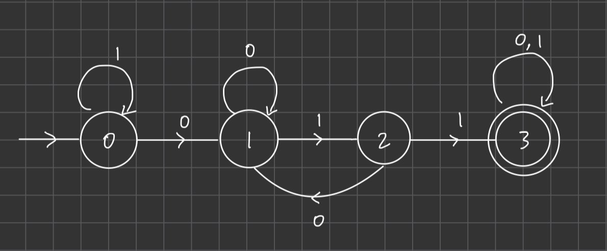
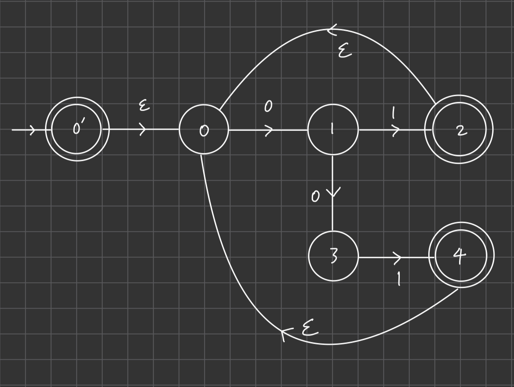
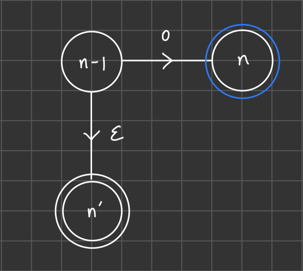

### Problem 1
The total number of functions $f:\cbrack{0,1}^n\to\cbrack{0,1}$ is $2^{2^n}$ because there are a total of $2^n$ n-bit strings, and for each string the output could be 0,1. So it's 2 output options multiple $2^n$ times.

To derive the total number of functions $f:\cbrack{0,1}^n\to\cbrack{0,1}^m$, we can use a similar argument. There are still $2^n$ possible input strings, but now the number of outputs is $2^m$. We raise the number of outputs to the power of the number inputs, obtaining
$$({2^m})^{2^n}$$
for the total number of functions $f:\cbrack{0,1}^n\to\cbrack{0,1}^m$.

### Problem 2
**(a)** The set of accept states is $S=\cbrack{3}$

**(b)** $0,1,2,2,0,1,2,2$

**(c)** $11$

### Problem 3

We stay at the initial state 0 until we see a 0, and then if we see two consecutive 1s we advance to state 3 and stay there forever because we know we have seen a 011 substring. While at state 1 and 2, if we see a 0 we reset to state 1 to again see if we can get two consecutive 1s after we just saw a 0. 

### Problem 4

We have a dummy 0' state to handle the empty string case. And then the actual NFA follows a DFA base model to handle the 011 (ends at state 4) and 01 (ends at state 2) cases, and then at each of the accepting states we epsilon transition back to the actual entry state (0) to try to find the next piece of input that satisfies 011 or 01.

### Problem 5

Denote the set of all states in the DFA that has an outgoing edge into an accepting state as $S$. For example state $n-1\in S$ in the above example. 

The idea is to add an epsilon transition from every $s\in S$ to a new accepting state $s'$ ($n'$ in above figure), and then remove all old accepting states from the DFA (blue circle $n$). This way, whenever we read to the last bit of $x$ where $x$ is defined in
$$DROPLAST(L) = \cbrack{x \mid xb \in L, b \in \cbrack{0,1}}$$
we will know we are done and immediately go to an accepting state via epsilon transition.