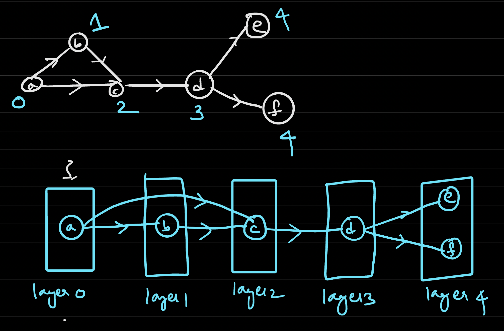

## Introduction
- what is computing?
  - data: representation of objects
  - algorithms: operations on data
- core questions in computing:
  - what can and can't you actually compute?
  - can computers solve a question P?
    - what does it mean to solve it?
- in this class, the order of importance is definition > theorems > proofs

### Representing Data as Binary Strings
- all forms of data (integers, audio, images, etc) can be encoded into just binary strings
  - note that we can compose representations, i.e. if we can represent objects of type T, then we can represent collections of objects of type T
- **Definition** $$E:\Theta \to \{0,1\}^*$$ is an encoding function if and only if there exists a mapping $$D:\binstr \to \Theta$$ such that for all $x\in \Theta$, $D(E(x))=x$.
  - note that $E$ *has* to be an one-to-one mapping, i.e. $$x\neq y \implies E(x)\neq E(y)$$
  - Kleene star notation means that $\{0,1\}^*$ is a sequence of 0s and 1s
- example:
  - unary representation of natural numbers $\N = \{0,1,2,\dots\}$
    - $E(0) = 0, E(1) = 00, E(2) = 000,\dots$
  - binary represention of $\N$
    - $E(0) = 0, E(1) = 1, E(2) = 01, E(3) = 11,\dots$
    - define $NtoB:\N \to \binstr$
- **Definition**
  - $E:\theta \to \binstr$ is **prefix free** if $\forall x,y\in \Theta$ $$x\neq y \implies E(x)\text{ not a prefix of } E(y)$$
- **Theorem**
  - Suppose we have a prefix free encoding $pE: \theta\to\binstr$. Then $$\overline{pE}: \Theta^* \to \binstr$$ defined by $$\overline{pE} ([x_0,x_1,\dots,x_k]) = pE(x_0)\circ pE(x_1)\circ\dots\circ pE(x_k)$$ is an encoding.
  - Remark: Given a prefix free encoding $pE$, $\overline{pE}$ is not necessarily prefix free.
- **Claim**
  - Given any encoding $E$, we can build a prefix free encoding $pE$ from it.
    - Algorithm:
      - compute $E(x)$
      - duplicate each bit
      - append $01$
    - eg $E(5)=101\implies pE(5)=11001101$
    - Efficiency: $pE = 2E+2$
- Note: we can assume in any algorithm that the input is a binary string
- Cantor in 1876: there is no one-to-one mapping from $\R\to\binstr$

## Algorithms as Circuits
- informally, an algorithm is a series of steps to solve some problem
  - problem - transform the input into some desired output
    - **specification** - function $f:\binstr\to\binstr$
  - series of steps - some basic operations

### Boolean Circuits
- simple operations
  - $AND:\zeroone\times\zeroone\to\zeroone$
    - $AND(a,b)$
      - $=1\text{ if }a=b=1$
      - $=0\text{ else}$
  - $OR:\zeroone\times\zeroone\to\zeroone$
    - $OR(a,b)$
        - $=0\text{ if }a=b=0$
        - $=1\text{ else}$
  - $NOT: \zeroone\to\zeroone$
    - $NOT(a,b)$
    - $=1\text{ if }a=0$
    - $=0\text{ if }a=1$
- more advanced operations built up
  - $XOR: \cbrack{0,1}^2\to\cbrack{0,1}$
    - $XOR(a,b)=$
      - $=1$ if exactly one of $a$ or $b$ is 1
      - $=0$ else
    - $XOR(a,b)=(\neg a\land b)\lor (b\land\neg a)$
  - $XOR3: \cbrack{0,1}^3\to\cbrack{0,1}$
    - $XOR3(a,b,c)$
      - $=1$ if odd number of $a,b,c$ is 1
      - $=0$ else
    - $XOR3=XOR2(XOR2(a,b),c)$
      - can reuse lower order $XOR$s to build higher order ones

### Directed Acyclic Graphs (DAGs)
- **definition**: a directed graph that has no cycles
- rigorous definition of boolean circuits using DAG
  - $A(n,m,s)$ - boolean circuits is a DAG with $n+s$ vertices
    - where $n$ number of input vars, $m$ number of output vars, and $s$ is size.
    - exactly $n$ vertices are inputs, labeled $x[0],x[1],\dots,x[n-1]$ 
      - input nodes have no incoming edges
    - the other $s$ vertices are gates ($\land,\lor,\neg$)
      - each AND, OR gate has exactly 2 incoming edges
      - each NOT gate has exactly 1 incoming edge
    - $m$ of the gates are labeled as outputs $y[0],y[1],\dots,y[m-1]$
  - remark:
    - there are many conventions that give the "same" models
    - $m\leq n+s$
- **topological sorting of DAGs**
  - If $G=(V,E)$ is a DAG, there exists a layering $h:V\to\N$ such that if $(i,j)$ is an edge, then $h(i)<h(j)$.
  - 
- **from circuit to computation via topological sorting**
  - layer the DAG via topological sorting so that all input vertices are in layer 0
  - we have computed in layers $0,1,\dots,k-1$:
    - now for each vertex in layer $k$, assign it the value of the incoming values after going through the gate that the vertex represents
  - thus our computational model is a mapping $$C:\cbrack{0,1}^n\to\cbrack{0,1}^m$$
    - we say a circuit $C$ computes a function $f$ if $$\forall x\in\cbrack{0,1}^n,f(x)=C(x)$$

### NAND Circuits
- $NAND:\cbrack{0,1}^2\to\cbrack{0,1}$
  - $NAND(a,b)=NOT(AND(A,b))$
- Remark: if we have a NAND circuit computing a function $f$, we could also get a boolean circuit to do it by simply replacing every NAND gate with an AND gate followed by a NOT gate.
- Moreover, the other direction is also true - we can use NAND gates to directly compute AND, OR, NOT gates
  - $NOT(a) = NAND(a,a)$
  - $AND(a,b)= NOT(NAND(a,b))$
  - $OR(a,b)=NAND(NOT(a),NOT(b))$
- **Theorem**
  - Boolean circuits are *equivalent* to NAND circuits in computational power.
  - i.e. $f$ is computable by a Boolean circuit $\iff$ $f$ is computable by a NAND circuit

### Universality of Boolean Circuits
- **Theorem 1**
  - Every function $f:\cbrack{0,1}^n\to\cbrack{0,1}^m$ can be computed by a Boolean circuit of size $O(n\cdot m\cdot 2^n)$
  - *Sketch of proof:* Imagine a truth table representing the function. It would be $n$ across, and $2^n$ down, as that is the number of combinations of different inputs you can have. Then there is a third dimension for the output, taking up $m$ different slots.
- **Def**
  - For a string $\alpha\in\cbrack{0,1}^n$, define $E_\alpha:\cbrack{0,1}^n\to\cbrack{0,1}$ as
    - $E_\alpha(x)_i=1$ if $x_i=\alpha_i$
    - = 0 otherwise
  - Can be thought as the AND of all inputs (put NOT gate before AND gate if $\alpha_i = 0$)
    - num AND gates $\leq (n-1)$
    - num NOT gates $\leq n$
    - $\implies$ total size of circuit $\leq 2n-1$
  - If $\cbrack{\alpha_0,\dots,\alpha_{N-1}}$ are all of the bit strings that result in $f(\alpha_i)=1$, then $$f(x) = OR(E_{\alpha_0}(x),\dots,E_{\alpha_{N-1}}(x))$$
    - We need $N-1$ OR gates for this
  - To OR together all $E_{a_i}(x)$, we require $$\text{num gates }\leq N\cdot(2n-1)+(N-1)\leq N\cdot(2n)\leq 2^n\cdot(2n)$$
    - the last inequality comes from the fact that $N\leq 2^n$
      - becase # strings where $f$ evaluates to 1 $\leq$ # of possible n-bit strings
  - *Remark*: this procedure is sometimes grossly inefficent.
    - e.g. $OR_n$ would take approximately $(2^n-1)\cdot 2n$ gates since there are $2^n-1$ strings where $\alpha$ is not all zero
      - notice we could've just used $n-1$ OR gates in sequence
  - *Remark:* this upperbound can be improved to $O(\frac{2^n}{n})$ gates.
- **Shannon's Theorem**
  - Some function $f$ requires $\dfrac{2^n}{24n}$ gates to compute
- **Theorem**
  - Every $(r,m,s)-NAND$ circuit can be represented by a Boolean string of length $O((n+s)\cdot\log_2(n+s))$
    - structure of string is:
    - (n, m, s, [m slots that enumerate the index of node for $y_i$], [s slots of 2-tuples containing indices of the nodes that go into gate $i$])
      - the string will be about
      - $$\aligned{
          3+m+2\cdot s &\leq 3+n+s+2s \\
          &\leq n+3s+3 \\
          &\approx n+s \quad \text{bits}
        }$$
      - and to encode integers of up to $n+s$ it takes about $\log (n+s)$ bits
      - then to make prefix-free encoding it takes $2\log (n+s) + 2$ bits, but we can drop constants
      - thus in totality we use $O((n+s)\cdot\log_2(n+s))$ bits
- **Theorem**
  - There exist a function $f: \cbrack{0,1}^n\to\cbrack{0,1}$ that has no NAND-CIRCUIT of size $\leq c\cdot\dfrac{2^n}{n}$ (for some $c>0)
    - $ALL_n = \cbrack{f:\cbrack{0,1}^n\to\cbrack{0,1}}$
      - class of all functions
    - $CIRCUIT(n,1,s)=\cbrack{f:\cbrack{0,1}^n\to\cbrack{0,1}\mid f \text{ computable by a NAND-CIRCUIT of size }\leq s}$
    - we want to show that $CIRCUIT(n,1,\dfrac{c\cdot 2^n}{n})\subset ALL_n$
      - i.e. $|CIRCUIT(n,1,\dfrac{c\cdot 2^n}{n})| < |ALL_n|$
        - this implies that there exists a function that does not have circuits of size $\leq \dfrac{c\cdot 2^n}{n}$
    - Claim: $|ALL_n|=2^{2^n}$
      - truth table of all n-bit strings will have $2^n$ rows, then for each row the output could be 0,1 (2 options)
    - Claim: $|CIRCUIT(n,1,\dfrac{c\cdot 2^n}{n})| \leq 2\cdot2^{12(n+s)\log{(n+s)}}$
      - $$\aligned{
        |CIRCUIT(n,1,\dfrac{c\cdot 2^n}{n}=s)| &\leq \text{\# of circuits of size s} \\
        &= \text{\# bin strings of length } L=12(n+s)\log{(n+s)}\\
        &= 2^0+2^1+2^2+\dots+2^L \\
        &= 2^{L+1}-1\\
        &\leq 2^{L+1}
      }$$
    - Big Idea: show separation between sets by counting the sizes
    - Big Idea: count the size of a set by first finding an encoding

### Universal Circuits
- **Def**
  - $EVAL: \cbrack{0,1}^{size(n,m,s)}\times \cbrack{0,1}^n\to\cbrack{0,1}^m$ where
    - $EVAL(C,x)=C(x)$
      - $C$ is the bin string representation of the $(n,m,s)$ circuit
    - in this context, EVAL is like a compiler, C is like a program, and x is the input
    - but what if an encoding doesn't correspond to a valid circuit?
      - $EVAL(C,x)=0^m$ in this case
- **Theorem**
  - There is a Boolean circuit that computes EVAL
    - *pf.* We  know every function has a circuit, which means EVAL itself has a circuit.
- **Theorem**
  - There is a circuit for $EVAL_{n,m,s}$ of size $O(s^2\log{s})$.

### Circuits Summary
- Circuits can be implemented as physical devices
- Every function can be computed by circuits
- Some functions require exponential-size circuits
- We can have "efficient circuits" that can compute EVAL, i.e. an "Universal Circuit" that can simulate all size $s$ circuits

## PECTT
- **Def**
  - Physical Extended Church-Turing Thesis (PECTT) - if a function $f:\cbrack{0,1}^n\to\cbrack{0,1}$ can be computed using $s$ physical resources then it can be computed by circuits that use roughly $s$ gates.
- Big Idea: fatal flaw of circuits is that we need to fix input lengths

## Finite Automata
- Remark: an algorithm is a *finite* answer to an *infinite* number of questions

### Deterministic Finite Automata (DFA)
- **Def**
  - <u> Deterministic Finite Automata (DFA)</u> with $C$ statesover $\cbrack{0,1}$ is a pair $D=(T,S)$ where $T:[C]\times\cbrack{0,1}\to[C]$ and $S\subseteq [C]$
    - note $[C]=\cbrack{0,1,2,\dots,C-1}$
    - $T(i,a) = j$ means "if in state $i$, reading bit $a$ --> jump to state $j$
    - $S$ is the set of "accepting/good" states
      - if the automata finishes running at one of these states, return 1, else return 0
  - we say a DFA $D=(T,S)$ computes a function $f:\cbrack{0,1}^*\to\cbrack{0,1}$ if $f(x)=D(x)$ for all $x\in\cbrack{0,1}^*$
  - remarks:
    - start state = 0
    - alphabet = {0,1}
  - anatomy of a DFA
    - fixed or bounded:
      - \# of states $C$
      - transition table $T$
      - set of accepting states $S$
    - unbounded:
      - input length
  - given a function $f:\cbrack{0,1}^*\to\cbrack{0,1}$, the corresponding language $L_f=\cbrack{x\in\cbrack{0,1}^* \mid f(x)=1}$, and a DFA $D$, the following phrases are equivalent
    - $D$ computes $f$
    - $D$ computes / accepts / recognizes language $L$
    - $D(x)=1\iff x\in L$
    - $D$ accepts $x\in L\iff D(x)=1$; $D$ rejects $x\not\in L \iff D(x)=0$

```
D: {0,1}^* -> {0,1} on input (x)

start from state S_0 = 0

for i = 0...len(x)-1:
  S_i+1 = T(S_i, x[i])

output 1 if final state in S, 0 otherwise
```


- $XOR(x)$ is a simple example
  - one pass through string $x$ and assign $(res+x_i) \% 2$ to $res$
  - Big Idea: $XOR$ uses single pass and constant (additional) memory
    - functions that can be computed in this way can be specially computed
- Why automata?
  - toy model for unbounded length inputs
  - recognizing patterns / regular expressions
  - leads to non-deterministic computation
  - allows us to undertand proving limitations of models
- Can we perform operations on functions computed by DFAs?
  - for instance (NOT)
    - if $f$ computable by a DFA $D=(T,S)$, is $NOTf$ also computable by a DFA?
      - yes! idea is to flip which states are accepting
      - $\bar{D} = (T, [C]\setminus S)$
  - another example (AND)
    - if $f_1,f_2$ are computable by DFAs, is $f_1\land f_2$ also computable by a DFA?
      - suppose the following:
        - DFA $D_1=(T_1,S_1)$ computes $f_1$ and has $C_1$ states
        - DFA $D_2=(T_2,S_2)$ computes $f_2$ and has $C_2$ states
      - we need to run $D_1,D_2$ in parallel
        - let states $C=C_1\times C_2=(i,j)$ where $i\in [0,C_1)$, $j\in [0,C_2)$
        - let transition table $T((i,j),a) = (T_1(i,a),T_2(j,a))$
        - let accepting states $S=\cbrack{(i,j)\mid i\in S_1,j\in S_2}=S_1\times S_2$
      - $D(T,S)$ computes $D_1(x)\land D_2(x)$
  - how about OR?
    - yes!
    - use same $T$ as above
    - redefine $S=\cbrack{(i,j)\mid i\in S_1 \text{ or } j\in S_2}$
  - Thus DFAs are "closed" under NOT, AND, OR

### More operations on DFAs
  - **Concatenation**
    - given $f_1,f_2:\cbrack{0,1}^*\to\cbrack{0,1}$ we define
      - $f_1 CAT f_2:\cbrack{0,1}^*\to\cbrack{0,1}$ as
        - $f_1 CAT f_2(x) = 1$ if $x$ can be split into two substrings $x_1,x_2$ such that $$f_1(x_1)=f_2(x_2)=1$$
        - = 0 otherwise
      - in terms of langauges
        - $L_1,L_2$ languages, i.e. $L_1,L_2\subseteq \cbrack{0,1}^*$
          - then $$L_1\circ L_2=\cbrack{x_1\circ x_2\mid x_1\in L_1, x_2\in L_2}$$
    - example
      - let $f_1(x)=1$ for all $x\in \cbrack{0,1}^*$
      - let $f_2(x)=1$ if $x$ starts with 1 and has exactly 4 bits
      - then $f_1 CAT f_2(x)= 1$ if the 4th bit from the end is 1
        - = 0 otherwise
  - **Theorem**
    - If $f_1,f_2:\cbrack{0,1}^*\to\cbrack{0,1}$ computable by a DFA, then their concatenation $f_1CATf_2:\cbrack{0,1}^*\to\cbrack{0,1}$ is also computable by a DFA.
  - **Reverse**
    - given $f:\cbrack{0,1}^*\to\cbrack{0,1}$, define
      - $f_{REVERSE}:\cbrack{0,1}^*\to\cbrack{0,1}$ as
        - $f_{REVERSE}(x)=f(REVERSE(x))$
    - if $f$ solvable by a DFA, can $f_{REVERSE}$ be solved by a DFA?
      - idea: reverse arrows and treat end state as entry and entry as end state
        - problems:
          - what if we have multiple end states?
          - multiple outgoing arrows with same bit label - which to take?

### Non-Deterministic Finite Automata (NFA)
- **Def**
  - A <u> Non-Deterministic Finite Automata</u> $N=(T,S)$ of $C$ states is described by a transition table $T:[C]\times\cbrack{0,1,\epsilon}\to POWER([C])$ and a set of accepting states $S\subseteq [C]$
    - $N(x) = 1$ if on any branch the final state is in S
      - = 0 otherwise
  - Remarks:
    - the transtition can also output the empty set $\empty$, which is shorthand for "dead state"
    - the $\epsilon$ edges do not create a cycle
    - a function $f:\cbrack{0,1}^*\to\cbrack{0,1}$ is computable by a NFA $N$ if $f(x)=N(x)$ for all $x\in \cbrack{0,1}^*$
  - characterstics of NFAs
    - can have multiple outgoing edges with same label
      - if there are $n$ outgoing edges with same label, branch into $n$ parallel universes
        - if any of the universes end on an accepting state, output 1
    - some edges are labeled by "$\epsilon$"
      - you can also take $\epsilon$ edges into a parallel universe *without reading any bits*
    - some edges can be missing, which means it goes to a "dead state"
- **Theorem**
  - If $f_1,f_2:\cbrack{0,1}^*\to\cbrack{0,1}$ computable by a DFAs $D_1,D_2$, respectively, then their concatenation $f_1CATf_2:\cbrack{0,1}^*\to\cbrack{0,1}$ is computable by a NFA.
  - *pf.*
    - simply create $\epsilon$ transition from every accepting state of $D_1$ to the entry state of $D_2$
      - now we will always try to explore $D_2$ on every potential conclusion of $D_1$
    - the accepting states of the NFA are the accepting states of $D_2$.
- **Theorem**
  - If $f_1:\cbrack{0,1}^*\to\cbrack{0,1}$ is computable by a DFA $D$, then $f_{REVERSE}$ is computable by a NFA.
  - *pf.*
    - 1. reverse all edges
    - 2. new accepting state is the old entry state
    - 3. add new "dummy" entry state and add $\epsilon$ transitions from it to old accepting states
- **Def**
  - *Kleene\* Operation on Functions*
    - Given $f:\cbrack{0,1}^*\to\cbrack{0,1}$ define the Kleene* of $f$, $f^*:\cbrack{0,1}^*\to\cbrack{0,1}$ by
      - $f^*(x)=1$ if you can break $x$ into $l$ ordered pieces such that
        - $f(x_0)=\dots=f(x_{l-1})=1$
      - and by convention, $f^*(\text{empty string})=1$
- **Claim**
  - If $f:\cbrack{0,1}^*\to\cbrack{0,1}$ is computable by a DFA, then $f^*$ is computable by a NFA.
    - idea 1: add $\epsilon$ transitions from accepting states to the start state
      - essentially works but does not always satisfy $f^*(\text{empty string})=1$
      - fix: add dummy start state that is always accepting, and has an $\epsilon$ transition to the acutal start state
- **Summary**
  - NFAs are non-detministic
  - NFAs can simulate CONCAT, REVERSE, and KLEENE*
- **Theorem**
  - Every NFA has an equivalent DFA, i.e. for every NFA $N$, there is a DFA $D$ such that $$N(x)=D(x), \forall x$$
  - **Corollary**
    - DFAs are able to compute CONCAT and KLEENE* operations
  - Suppose we have NFA $N$ with states $[C]$, transition function $$T_N:[C]\times \cbrack{0,1,\epsilon}\to Power([C])$$ and accepting states $S_N\subseteq [C]$
    - define DFA $D$ with:
      - states = $Power([C])$
      - transition function $T_D:Power([C])\times\cbrack{0,1}\to Power([C])$ defined $$T_D(I,a)=Eps\left(\bigcup_{i\in I} T_N(i,a) \right)$$
        - where $Eps(i),i\in [C]$ is all states we can reach from state $i$ by following $\epsilon$ edges and $i$ itself.
          - if $I\subseteq [C]$, $$Eps(I)=\bigcup_{i\in I} Eps(i)$$ i.e. the union of all states we can reach from each element of $I$ by following $\epsilon$ edges
      - accepting states $S_D=\cbrack{I\subseteq[C]\mid I\cap S_n\neq \empty}$
      - start state = $Eps(\cbrack{0})$
  - Pseudocode for computing NFAs
    - def computeNFA(x, $T_n$, $S_n$):
      - state = {0}
      - for i in range(len(x)):
        - state = $\bigcup_{j\in state} T_N(j, x[i])$
      - return 1 if $state\cap S_n\neq \empty$
        - 0 else
- Remarks:
  - if NFA has C states, each step in algo takes about O(C) time
    - thus we can simulate a NFA of C states on an input of length n in roughly O(nc) time
  - 